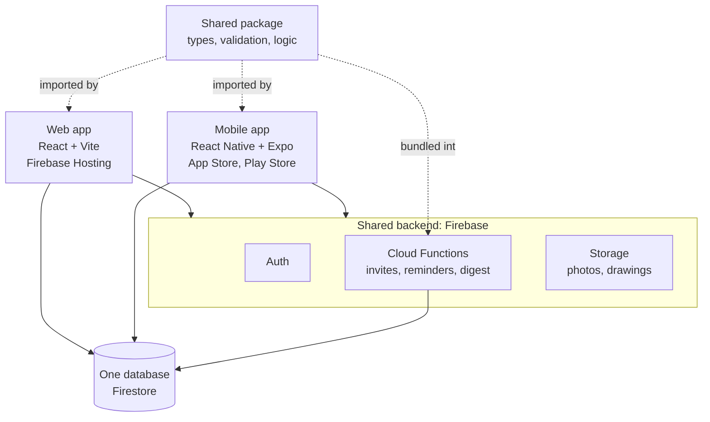

# Architecture



**Data model** (multi-tenant, every company is isolated by security rules):
```
users/{uid}                                   role, companyId, siteIds
companies/{cid}                               name, modules, notifications
companies/{cid}/equipment/{id}
companies/{cid}/activity/{id}                 audit trail (functions write)
companies/{cid}/sites/{sid}                   project
companies/{cid}/sites/{sid}/{collection}/{id} materials, materialLogs, workers, attendance,
                                              reports, expenses, changeOrders, rfis, inspections,
                                              punchItems, subcontractors, incidents, toolboxTalks,
                                              tasks, drawings, documents, billing
```

**Why these choices**
- *Vite, not Next.js*: the app sits behind a login, so server rendering adds cost and complexity without benefit. Vite builds a static site that Firebase Hosting serves from its CDN.
- *React Native Firebase on mobile*: full offline Firestore on the phone. Sites often have no signal.
- *npm workspaces*: the simplest monorepo tool that Expo and Firebase both support. Move to Turborepo later only if builds get slow.
- *Functions bundled with esbuild*: Firebase uploads the functions folder alone, so the shared package is bundled in at build time.
