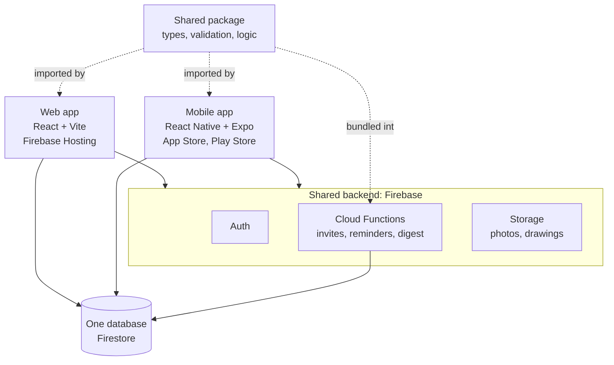

# Architecture



**Data model** (multi-tenant, every company is isolated by security rules):
```
users/{uid}                                   the person: name, email, phone, companyIds, companyId
                                              (the company they are looking at); created by functions
companies/{cid}                               name, plan, modules (server-set), notifications
companies/{cid}/members/{uid}                 role, siteIds, active, invitation, per company
                                              (one login, several companies; functions write)
companies/{cid}/equipment/{id}
companies/{cid}/activity/{id}                 audit trail (functions write)
companies/{cid}/sites/{sid}                   project (one project = one site); no money fields
companies/{cid}/sites/{sid}/finance/summary   budget, spent (finance roles only)
companies/{cid}/sites/{sid}/workerPay/{wid}   daily rate, bank (finance roles only)
companies/{cid}/sites/{sid}/attendance/{date} present: { workerId: bool }, merged per worker
companies/{cid}/sites/{sid}/{collection}/{id} materials, materialLogs, workers, reports, expenses,
                                              changeOrders, rfis, inspections, punchItems,
                                              subcontractors, incidents, toolboxTalks, tasks,
                                              drawings, documents, billing
```

**Security model**
- Roles and permissions: `packages/shared/src/permissions.ts`, mirrored in `firebase/firestore.rules` and
  `storage.rules`, and checked role-by-role in `firebase/tests`.
- A material's stock only changes in the same batch as a material log for the same quantity (the rules
  check it with `getAfter`). Delivery costs, expenses and wage rates need a finance role.
- Companies and profiles are created by Cloud Functions (`createCompany`, `inviteMember`), so plan,
  modules and roles can't be chosen by the client.

**Why these choices**
- *Vite, not Next.js*: the app sits behind a login, so server rendering adds cost and complexity without benefit. Vite builds a static site that Firebase Hosting serves from its CDN.
- *React Native Firebase on mobile*: full offline Firestore on the phone. Sites often have no signal.
- *npm workspaces*: the simplest monorepo tool that Expo and Firebase both support. Move to Turborepo later only if builds get slow.
- *Functions bundled with esbuild*: Firebase uploads the functions folder alone, so the shared package is bundled in at build time.
